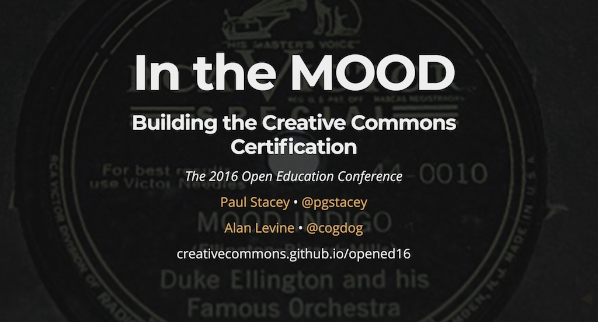

# In the MOOD: Building the Creative Commons Certification

*Paul Stacey & Alan Levine, Open Education 2016 Conference, Nov 4, 2016*

Presentation that formerly was at `http://creativecommons.github.io/opened16/` but seems to have vanished. Archived here because I can! 

http://cogdog.github.io/opened16